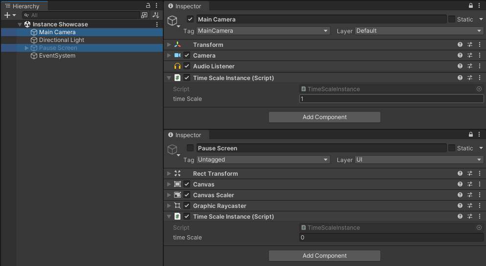

# Instance

Singletons are a widely accepted anti-pattern within Unity, and their use is not recommended. There are however valid use cases for wanting to interact with static functions through Components.

The `Instance<T>` type provides a singleton implementation that aims to adhere to the [single responsibility principle](https://en.wikipedia.org/wiki/Single_responsibility_principle) by working independently from other types. Rather than referencing `Instance<T>` in other classes, it is used more like a state setter. An `Instance<T>` is supposed to manipulate static api values when it becomes the current instance. Similarly, the last known instance will set its state when the current instance is deactivated.

Unlike most singleton implementations that allow only 1 instance, `Instance<T>` does not restrict the amount of instances. Note that the last enabled `Instance<T>` will be the current `Instance<T>`.

## Example

A simple example is a time scale setter implemented through instances. 

```csharp
[DisallowMultipleComponent]
public class TimeScaleInstance : Instance<TimeScaleInstance>
{
    [field: SerializeField] public float timeScale { get; set; } = 1f;

    public override void OnCurrent()
    {
        Time.timeScale = timeScale;
    }
}
```



When our game starts, the `TimeScaleInstance` on the camera is recognized and our time scale is set to 1. When our pause screen gets enabled however, our time scale is set to 0. Then, when our pause screen gets disabled, the `TimeScaleInstance` recognizes the last known instance and resets the time scale back to 1.

By virtue of implementation, it becomes trivial to make a weapon select menu that puts us in slowmotion rather than stopping time completely.


### Singleton

It is possible to derive from `Instance<T>` to create a true singleton implementation that only allows one instance at a time.

```csharp
/// <summary>
/// A singleton implementation where there will only ever exist 0 or 1 instances of the singleton.
/// </summary>
public abstract class Singleton<T> : Instance<T> where T : Singleton<T>
{
    protected virtual void Awake()
    {
        if (current)
        {
            Destroy(this);
        }
        else
        {
            DontDestroyOnLoad(this);
        }
    }
}
```

However, as Cubusky only uses the singleton pattern to set static state dynamically, the above would be the same as using [RuntimeInitializeOnLoadMethod](https://docs.unity3d.com/ScriptReference/RuntimeInitializeOnLoadMethodAttribute.html), which is strongly recommended over the use of singletons.